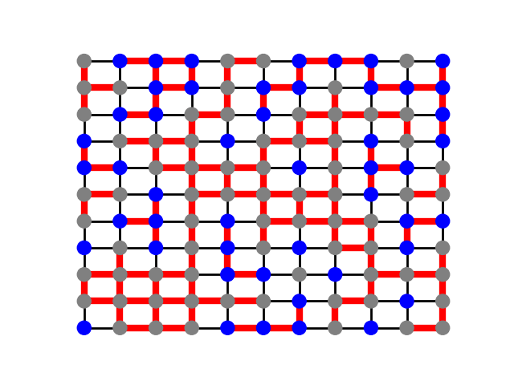
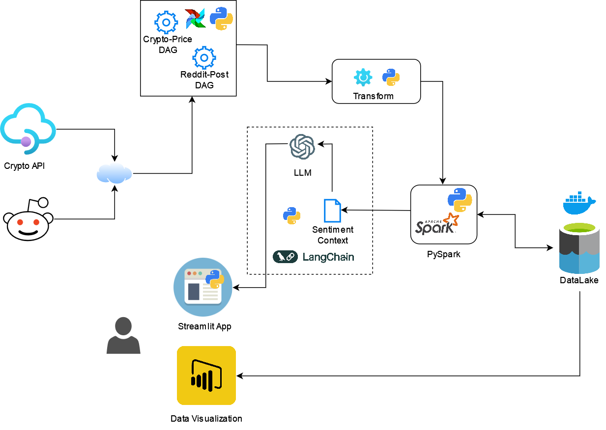
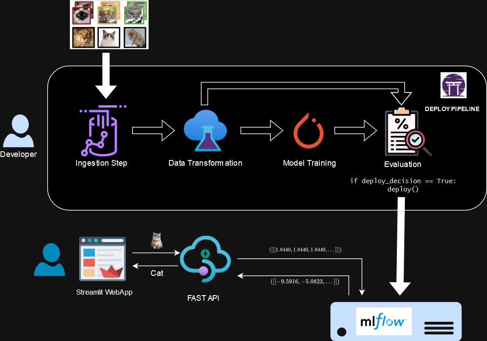

# Data Scientist | Software Developer

#### Technical Skills: Python, Pytorch, MLOps, DevOps, AWS, DATALAKE, Java, SQL

## Education				       		
- M.S., Data Science	| RWTH Aachen University, Aachen, Germany (_November 2024_)	 			        		
- B.Tech., Computer Science | SRM University, Chennai, India (_June 2016_)

## Work Experience
**Generative AI Developer (Student Assistant) @ E.ON Energy Research Center (_December 2023 – Present_)**
- Implemented Test Scenarios for Cyber Attack Detection on Power Grid Lines.
- Developed a chain using RAGs to integrate a Large Language Model for generating attack graphs based on Power Grid network infrastructure context from a Neo4j database. Improved the detection pipeline’s performance by replacing the slower MULVAL-based attack detection method, resulting in a significant boost in efficiency.

**Data Engineer @ Munich RE (_April 2023 – October 2023_)**
- Processed, cleansed, and analyzed unstructured cyber insurance data from various clients, identifying and rectifying data quality issues to enhance accuracy and reliability for underwriters and risk assessments.
- Developed Power BI dashboards for internal stakeholders, providing detailed insights and analysis into insurance data.

**Research and Development Engineer @ Dassault Systèmes (_February 2018 – March 2020_)**
- Developed and maintained various components for Dassault’s PLM Tool ENOVIA, including Web UI and backend components.

**Assistant System Engineer @ Tata Consultancy Services (_May 2016 - February 2018_)**
- Java Web Developer for Cross Border Payment Sysem, WorldLink. 

## Projects
### Learning Heuristics for Counting Problems with GNN - Masters Thesis, 2024
[GitLab](https://git.rwth-aachen.de/supreetshm947/anycsp_enum/)

   
  <em>ANYCSP enumerating 2-coloring solution for an 11 x 11 Grid graph.</em>

Built on the foundation of [ANYCSP](https://arxiv.org/abs/2208.10227), which addresses Constraint Satisfaction Problems (CSPs) as a decision problem, this work extends its application to counting problems in Graph Coloring and Boolean Satisfiability.

The model introduces a novel Graph Representation called the Constraint Value Graph, which represents input CSP problems and processes them through a Recurrent Graph Neural Network sampling a list of solutions. It is trained through Reinforcement learning on a configurable training distribution that generates random instances.

### CryptoDataPipeline

   

[GitLab](https://github.com/supreetshm947/CryptoDataPipeline)

Developed a comprehensive data pipeline for acquiring both real-time and historical cryptocurrency pricing data, as well as related Reddit submissions. Orchestrated data collection with Apache Airflow and used PySpark to load data into a Datalake via a Minio Docker Container. Implemented real-time trend analysis by collecting Reddit submissions through Airflow DAGs, storing them in Elasticsearch, and later in Datalake parquet format for sentiment analysis. This ongoing personal project focuses on integrating sentiment analysis with pricing data and plans to incorporate LLMs using Retrieval-Augmented Generation (RAG).

### Machine Learning (MLOps) Workflow and Deployment using ZENML for an Image Classification Model

[Github](https://github.com/supreetshm947/CryptoDataPipeline)

   

I implemented a holistic machine learning workflow, including deployment, for an image classification model built with PyTorch and trained on the CIFAR-100 dataset. The MLOps pipeline was developed using ZenML for orchestration, covering all stages from data ingestion and processing to model training, evaluation, and deployment. I created a Streamlit application as the web user interface, allowing end users to upload and classify images. Additionally, I set up a FastAPI server for backend services to facilitate communication between the Streamlit app and the deployed model on the MLOps server for inference. The goal was to showcase the integration of machine learning pipelines with MLOps tools and demonstrate how to serve a deep learning model using a modern full-stack setup.

### Graph Learning, 2021

[Github](https://github.com/supreetshm947/GraphLearning)

### AI Snake Game , 2022

[Github](https://github.com/supreetshm947/AISnake)

### Covid Tableau Dashboard, 2022

[Tableau](https://public.tableau.com/app/profile/supreet.sharma/viz/Covid_data_demo)
